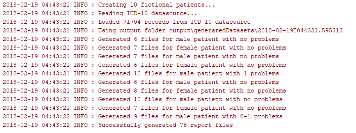
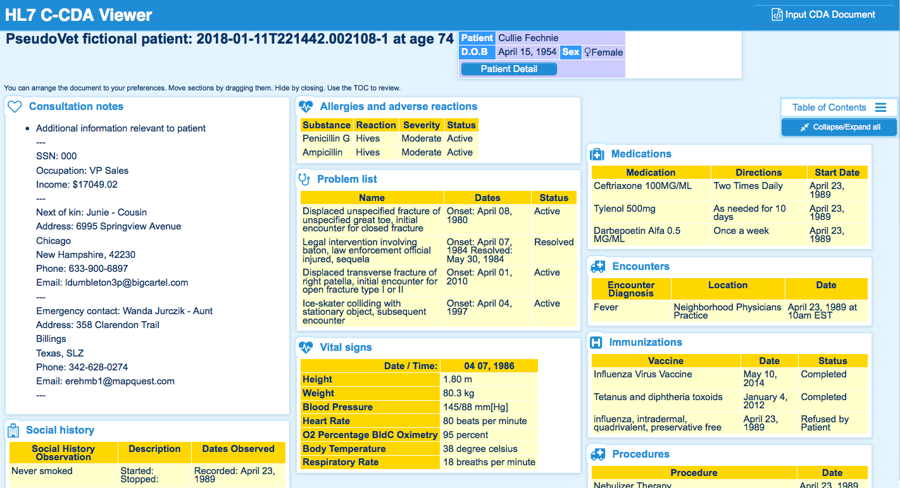

# PseudoVet Randomizer and Aging

## Description
This CLI utility creates C-CDA compliant documents of any number of fictional patients, using random data. It has the following features:
1. Builds C-CDA documents for the specified number of veterans of the specified study profile.
2. Calculates death based on [life expectancy](https://en.wikipedia.org/wiki/List_of_sovereign_states_by_life_expectancy) and modifies C-CDA documents accordingly.
3. Distributes gender and morbidities across patients according to the provided probabilities and exclusion rules.
4. Ages the patient records until death or specified report end year.

## Extensibility
This library uses the very powerful [Jinja2](http://jinja.pocoo.org/docs/2.10) templating engine which allows great flexibility and readability of the XML template files. Jinja2 is the most widely used templating engine by all Python developers.

Jinja2 template files were created for the **Continuity of Care Document (CCD)** and it would be easy to add new templates using the same library.

The templates are populated from variables read from a data source file (see `datasources/datasource.json`) which allows even more extensibility. New variables can be added to the data source and they will be readily usable in the templates.

## Demonstration video
Demo video of the recent version: https://youtu.be/EspoccXdhzk
Original demo video is here: https://youtu.be/8drwJ9o3OEE

## Prerequisites
1. Python 3.6.0
2. pip3 9.0.1

## Local Deployment
Extract the zip contents to a folder, and cd into that folder
```bash
unzip pseudo-vets.zip -d pseudo-vets
cd pseudo-vets
```

Make sure you are using the correct Python3 and pip3 version (see above). If using virtualenv you can do this:
```bash
virtualenv --version
mkdir ~/virtualenvs
virtualenv -p python3 ~/virtualenvs/pseudo-vets
source ~/virtualenvs/pseudo-vets/bin/activate
```

Now install the script dependencies:
```bash
# this can take a couple of minutes
pip3 install -r requirements.txt 
```

Verify the script is working and see the help screen:
```bash
python3 pseudo-vets.py --help
```
That will produce this help screen:
```bash
PseudoVet Randomizer and Aging.

Description:
Creates C-CDA conformant documents of fictional patients using random data and
optional dataset configuration parameters.

Usage:
  pseudo-vets.py [-c path] [-t title] [-w code] [-n number] [-o output] [-y year]

Options:
    -c path         Path to the dataset configuration file.
    -t title        Title of dataset configuration to be used.
      At maximum one of -c and -t switches is expected to be specified.
    -s code         Code of study profile for which records are created.
      E.g. world_war_ii, vietnam_war, korean_conflict or gulf_war.
      Can override value specified in dataset configuration file.
      Default is world_war_ii.
    -n number       Integer number of records to create. Defaults to 1.
      Can override value specified in dataset configuration.
    -o Output       Path to the folder where the output files shall be saved to. Will be created if non existent.
      Defaults to ./output/generatedDatasets
      Can override value specified in dataset configuration.
    -y year         End year for the reports to be generated.
      Defaults to the current year
      Can override value specified in dataset configuration.

    -h --help       Show this screen.
    -v --version    Show version.
```

## Production Build and Installation
To move to a production server, just unzip the files to a folder in the target server and make sure the script runs under a user with permissions to create the work folder (by default `./output`) and write to it.

## Verification guide
Run the script with the default options like this:
```bash
python3 pseudo-vets.py 
```
You should see logs like these:
 

The script creates an output folder (default is ``./output/generatedDatasets` and each time it runs, it creates a subfolder to hold the results, for example: a folder `./output/generatedDatasets/2018-01-11T163449.235942` will hold the patient files of the work session `2018-01-11T163449.235942`


### Document scoring
Any resulting document can be validated with the [C-CDA Scorecard](https://sitenv.org/scorecard/). As of version 1.0 of this script the scores are **at least 95/100**. 

### C-CDA Viewer
Useful for verification is also this online [C-CDA Viewer](http://brynlewis.org/challenge/index.htm) copy the contents of the file to verify, and paste on the text area in the web page; then click the view button above the text area. In a few seconds, you should see a screen like this one:



## File names
The general format of the file name is `{session_id}-{patient_number}_{age}.xml`. For each patient there will be variable number of files. This number depends on the random interval between reports, end report date, patient's birth and death dates. File names for patient_number 1 would be like these:

- `2018-01-11T163449.235942-1_42.xml` - report at age 42
- `2018-01-11T163449.235942-1_45.xml` - report at age 45
- `2018-01-11T163449.235942-1_52.xml` - report at age 52
- `2018-01-11T163449.235942-1_59.xml` - report at age 59

## Docs
The C-CDA Implementation Guide is included for convenience in `docs/C-CDAImplementationGuide.pdf`

## Licenses 
To the best of my knowledge, all libraries used are open source. The ICD-10 problems list under the folder `./datasources/ICD-10` are covered by [this license](http://apps.who.int/classifications/apps/icd/ClassificationDownloadNR/license.htm) and were downloaded from [here](ftp://ftp.cdc.gov/pub/Health_Statistics/NCHS/Publications/ICD10CM/2018/)

